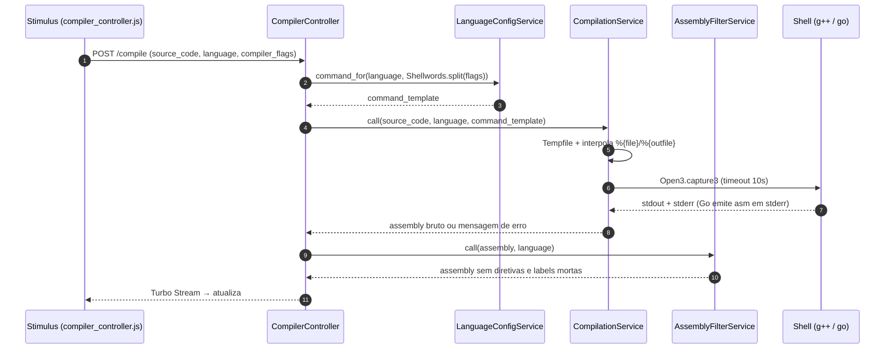

# EscovaBits

Visualizador de assembly. Você escreve código C++ ou Go, o servidor compila
e devolve o assembly gerado — filtrado, com diretivas e labels mortas
removidas. Inspirado no Compiler Explorer, com interface própria.

Stack: Rails 8, SQLite, Hotwire (Turbo + Stimulus), Tailwind, importmap.
Deploy com Kamal/Docker.

## Como funciona

### Rotas

| Método | Caminho         | Ação                                   |
|--------|-----------------|----------------------------------------|
| GET    | `/`             | Editor (index)                         |
| POST   | `/compile`      | Compila e devolve Turbo Stream         |
| POST   | `/share`        | Persiste snippet, devolve `{ url }`    |
| GET    | `/s/:slug`      | Abre o editor com snippet salvo        |
| GET    | `/hello_world`  | Template inicial por linguagem         |

### Fluxo de compilação



1. O Stimulus (`compiler_controller.js`) faz debounce de 2,5 s sobre a
   digitação e dispara `POST /compile` com `source_code`, `language` e
   `compiler_flags`.
2. `CompilerController#compile` resolve o template de comando via
   `LanguageConfigService.command_for(language, flags)` — as flags do
   usuário passam por `Shellwords.split` antes.
3. `CompilationService` grava o código num `Tempfile`, substitui
   `%{file}`/`%{outfile}` no template e executa com `Open3.capture3`
   sob `Timeout` de 10 s. Se o processo sai com sucesso, stdout e stderr
   são concatenados (o Go emite o assembly em stderr); em falha, o
   stderr é devolvido como mensagem de erro.
4. `AssemblyFilterService` limpa a saída: remove diretivas, comentários
   e labels não referenciadas, com regras por linguagem.
5. O resultado volta num Turbo Stream que atualiza `output_frame` —
   sem reload.

### Compartilhamento

`POST /share` cria um registro `snippets` (`slug`, `source_code`,
`language`, `compiler_flags`). O slug é `SecureRandom.alphanumeric(8)`
gerado em loop até ser único. `GET /s/:slug` renderiza o `index` com os
campos preenchidos.

## Configuração

### Adicionar uma linguagem

Toda linguagem é uma entrada no hash `LANGUAGES` em
`app/services/language_config_service.rb`:

```ruby
"rust" => {
  hello_world: "fn main() { println!(\"hi\"); }",
  extension: ".rs",
  needs_outfile: false,
  command: ->(flags) {
    ["rustc", "--emit=asm"] + flags + ["%{file}", "-o", "-"]
  }
}
```

- `extension`: sufixo do arquivo temporário.
- `needs_outfile`: se `true`, o serviço cria um segundo `Tempfile` e o
  caminho substitui `%{outfile}` no comando (necessário para `go build`,
  que exige `-o`).
- `command`: lambda que recebe as flags do usuário já separadas e
  devolve o array do comando. Use `%{file}` e `%{outfile}` como
  placeholders.

O binário do compilador precisa estar no `PATH` do processo Rails.
Não há allowlist de flags: qualquer flag enviada pelo cliente entra no
comando — rode atrás de sandbox/contêiner se isso for exposto.

### Filtro de assembly

`AssemblyFilterService::FILTERS` define por linguagem as regexes de
diretiva, label e comentário, e se labels numéricas são descartadas.
Para suportar uma linguagem nova no filtro, adicione uma entrada com
a mesma chave do hash `LANGUAGES`.

## Executar

Requisitos: Ruby 3.4.x (ver `.ruby-version`), `g++` e/ou `go` no PATH
para compilação real.

```bash
bin/setup        # gems, banco SQLite, seeds
bin/dev          # rails server + tailwind via Procfile.dev
```

App em http://localhost:3000.

### Testes

```bash
bin/rails test
```

### Docker

```bash
docker build -t escovabits .
docker run -p 3000:80 escovabits
```

O `Dockerfile` instala os compiladores usados pelos serviços. Há também
`Dockerfile.test` para a suíte.

### Deploy

Kamal (`config/deploy.yml`): `kamal setup` na primeira vez,
`kamal deploy` nas seguintes.

## Diagramas

- `docs/diagramaDER.png` — DER da tabela `snippets`.
- `docs/esvobabits_ClassDiagram(UML).png` — classes e serviços.
- `UML_Class_Diagram.md` — fonte PlantUML do diagrama de classes.
